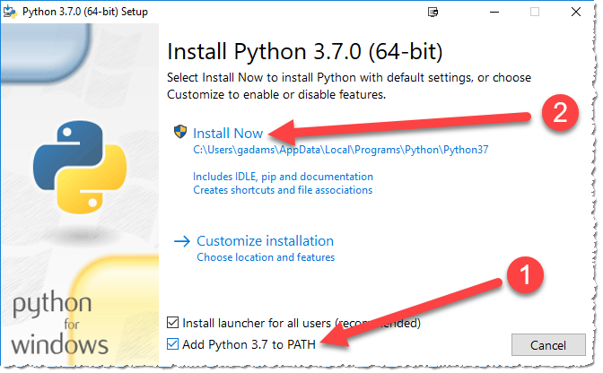

# Lab 1: Local Development Environment

Upon completion a local editor, development tools, and clone of this repository will be setup locally on your laptop. Also, you will have verified all web sites and developer accounts needed.

First you will install the integrated development environment and supporting tools.

## Local Laptop Hygiene

In order to keep track of the various downloads, compiled code, etc., it is best to setup your directory structure ahead of time. The following are the default locations and recommendations prior to installing anything locally.

Here are the common terms used, location will be dependent upon Windows or macOS, each which have their own section below.

* **Download Directory** - The default location where files are downloaded from your web browser. Please clear out this directory, or make a subdirectory and move all previous downloads to that, to make it easier to track and find the downloads for this lab.
* **BASE_DIR** - This is the base, or top level, of all the files you will clone from GitHub. Please place this as close to the top of your directory structure as possible.

<details>
<summary><strong>Windows laptop setup (exapand for details)</strong></summary>
<p>

* **Download Directory** - Make sure you can open a Windows Explorer to this location and clean out or stash the existing files. You will have to navigate to this later.
* **BASE_DIR** - It is recommended to place this at the root of your C:\ drive, and name it `tm_iot`.
* **How to add commands to your PATH** - [Here is a web page](https://helpdeskgeek.com/windows-10/add-windows-path-environment-variable/) that goes through this process. Please open or reference if needed.

</p></details>
<details>
<summary><strong>macOS laptop setup (exapand for details)</strong></summary>
<p>

* **Download Directory** - By default this is `~/Downloads`, where the `~` references your home directory.  Make sure you can open a Finder window to this location and clean out or stash the existing files. You will have to navigate to this later.
* **BASE_DIR** - It is recommended to place this at the root of your user directory and name it `tm_iot`. An easy way is to open a terminal session and follow these commands:

   ```bash
   $ cd ~
   $ mkdir tm_iot
   ```

* **How to add commands to your PATH** - [Here is a web page](https://blog.just2us.com/2011/05/setting-path-variable-in-mac-permanently/) that explains this process. Please open or reference in needed.

</p></details>

:bulb: At this point you now have your laptop cleaned up and directory made to hold our code and supporting tools.


## Install Microsoft Visual Studio Code

From a browser navigate to the [installation page](https://code.visualstudio.com/download) for Microsoft Visual Studio Code (VSCode) and download and run the installer locally. This will install VSCode and make it available to launch from your Applications list.

<details>
<summary><strong>VSCode Installation Instructions (exapand for details)</strong></summary>
<p>

1. [Download the installer package](https://code.visualstudio.com/download) for your operating systems, 64-bit is recommended

1. Run the installer and modify the *Select Additional Tasks* to allow VSCode to interact from Windows Explorer:

   

1. Launch VSCode. There is good chance you will need to upgrade (look for a small blue icon in the lower left where the settings :gear: icon is located.

   

</p></details>

## Install Python 3

All development will use the Python 3 language and some additional packages (modules) to work with your local code. If you already have Python 3.x installed, you can skip these steps. It is recommended to run Python in a virtual environment where possible. Instructions here do *not* take that into consideration.

<details>
<summary><strong>Install Python 3 for Windows (exapand for details)</strong></summary>
<p>

1. Download the Python 3.7.0  installer package [from the main download page](https://www.python.org/downloads/), [64-bit is recommended - direct link](https://www.python.org/ftp/python/3.7.0/python-3.7.0-amd64.exe)

1. Run the installer:

   

   1. Select *Add Python 3.7 to PATH*
   2. Click *Install Now*

1. Click the *Disable path length limit**:

   

1. Once VSCode has restarted, you can verify python is running by creating a terminal `CTRL-SHIFT-~` and typing `python` at the prompt:

   ```powershell
   C:\tm_iot>python
   Python 3.7.0 (v3.7.0:1bf9cc5093, Jun 27 2018, 04:59:51) [MSC v.1914 64 bit (AMD64)] on win32
   Type "help", "copyright", "credits" or "license" for more information.
   >>>
   ```

</p></details>

<details>
<summary><strong>Install Python 3 for macOS (exapand for details)</strong></summary>
<p>

1. Download the Python 3.7.0  installer package [from the main download page](https://www.python.org/downloads/), [64-bit is recommended - direct link](https://www.python.org/ftp/python/3.7.0/python-3.7.0-amd64.exe)

1. Run the installer:

   

   1. Select *Add Python 3.7 to PATH*
   2. Click *Install Now*

1. Click the *Disable path length limit**:

   

1. Once VSCode has restarted, you can verify python is running by creating a terminal `CTRL-SHIFT-~` and typing `python` at the prompt:

   ```powershell
   C:\tm_iot>python
   Python 3.7.0 (v3.7.0:1bf9cc5093, Jun 27 2018, 04:59:51) [MSC v.1914 64 bit (AMD64)] on win32
   Type "help", "copyright", "credits" or "license" for more information.
   >>>
   ```

</p></details>

## Install Serial Driver


## Install Platformio


## Install / Configure Serial Terminal


## Verify Amazon Developer Account


## Create CloudMQTT Account


## Clone GitHub Repository


