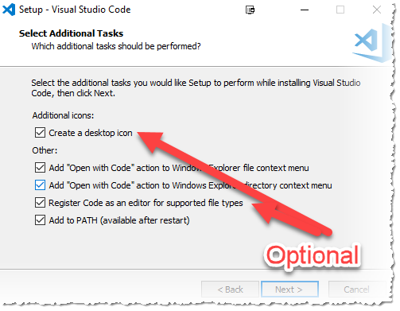
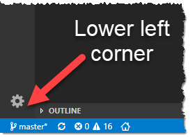
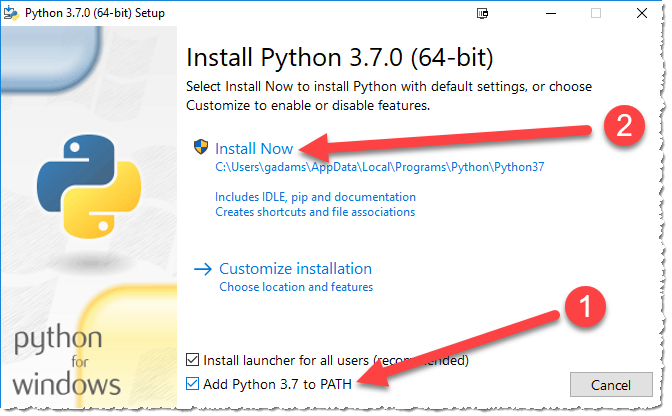
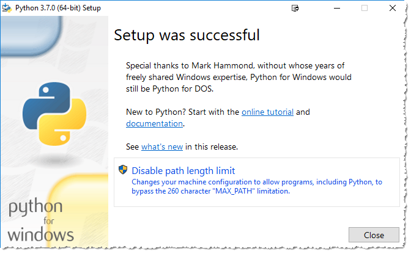
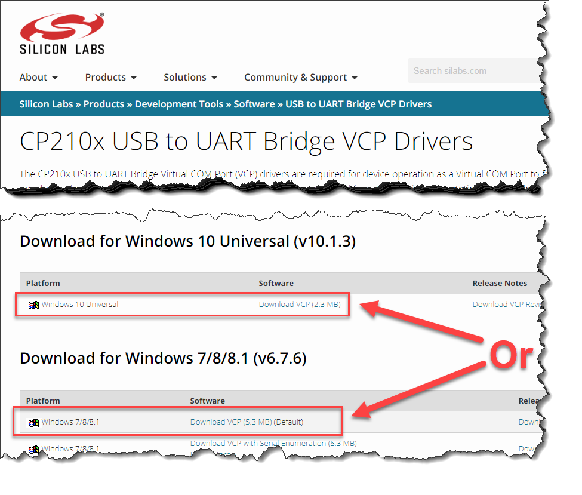
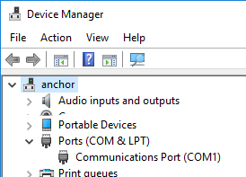
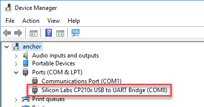
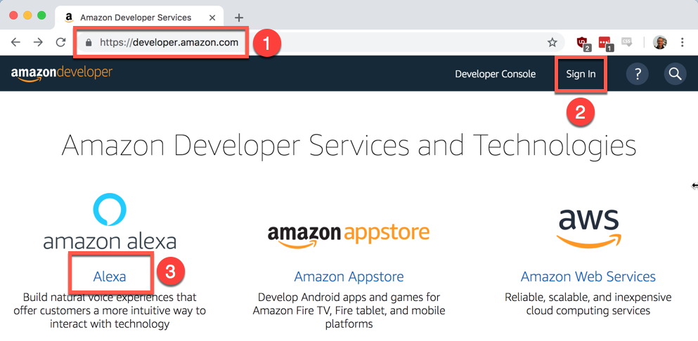

# Module 1: Local Development Environment

Upon completion a local editor, development tools, and clone of this repository will be setup locally on your laptop. Also, you will have verified all web sites and developer accounts needed.

First you will install the integrated development environment and supporting tools.

## Local Laptop Hygiene

In order to keep track of the various downloads, compiled code, etc., it is best to setup your directory structure ahead of time. The following are the default locations and recommendations prior to installing anything locally.

Here are the common terms used, location will be dependent upon Windows or macOS, each which have their own section below.

* **Download Directory** - The default location where files are downloaded from your web browser. Please clear out this directory, or make a subdirectory and move all previous downloads to that, to make it easier to track and find the downloads for this module.
* **BASE_DIR** - This is the base, or top level, of all the files you will clone from GitHub. Please place this as close to the top of your directory structure as possible. For all references, either `C:\tm_iot` (Windows) or `~/tm_iot` (macOS/Linux) will be used. Please adjust according to your actual location.

<details>
<summary><strong>Windows laptop setup (exapand for details)</strong></summary>
<p>

* **Download Directory** - Make sure you can open a Windows Explorer to this location and clean out or stash the existing files. You will have to navigate to this later.
* **BASE_DIR** - It is recommended to place this at the root of your C:\ drive, and name it `tm_iot` (e.g, `C:\tm_iot`).
* **How to add commands to your PATH** - [Here is a web page](https://helpdeskgeek.com/windows-10/add-windows-path-environment-variable/) that goes through this process. Please open or reference if needed.

</p></details>
<details>
<summary><strong>macOS laptop setup (exapand for details)</strong></summary>
<p>

* **Download Directory** - By default this is `~/Downloads`, where the `~` references your home directory.  Make sure you can open a Finder window to this location and clean out or stash the existing files. You will have to navigate to this later.
* **BASE_DIR** - It is recommended to place this at the root of your user directory and name it `tm_iot`. An easy way is to open a terminal session and follow these commands:

   ```bash
   $ cd ~
   $ mkdir tm_iot
   ```

* **How to add commands to your PATH** - [Here is a web page](https://blog.just2us.com/2011/05/setting-path-variable-in-mac-permanently/) that explains this process. Please open or reference in needed.

</p></details>

:bulb: At this point you now have your laptop cleaned up and directory made to hold our code and supporting tools.


## Install Microsoft Visual Studio Code

From a browser navigate to the [installation page](https://code.visualstudio.com/download) for Microsoft Visual Studio Code (VSCode) and download and run the installer locally. This will install VSCode and make it available to launch from your Applications list.

1. [Download](https://code.visualstudio.com/download) VSCode and install
2. Run VSCode and perform any required updates

<details>
<summary><strong>VSCode Installation Instructions (exapand for details)</strong></summary>
<p>

1. [Download the installer package](https://code.visualstudio.com/download) for your operating systems, 64-bit is recommended

1. Run the installer and modify the *Select Additional Tasks* to allow VSCode to interact from Windows Explorer:

   

1. Launch VSCode. There is good chance you will need to upgrade (look for a small blue icon in the lower left where the settings :gear: icon is located.

   

</p></details>

## Install Python 3

All development will use the Python 3 language and some additional packages (modules) to work with your local code. If you already have Python 3.x installed with pip, you can skip these steps. It is recommended to run Python in a virtual environment where possible. Instructions here do *not* take that into consideration.

:exclamation: If you think you already have some version of Python 3 installed, ask for assistance to ensure the commands below do not affect you existing projects and environment.

1. [Download](https://www.python.org/downloads/) Python 3.7 for your operating system
2. Install and add the Python directory to your path
3. Test and ensure `python3` runs with the correct version

<details>
<summary><strong>Install Python 3 for Windows (exapand for details)</strong></summary>
<p>

1. Download the Python 3.7.0  installer package [from the main download page](https://www.python.org/downloads/), [64-bit is recommended - direct link](https://www.python.org/ftp/python/3.7.0/python-3.7.0-amd64.exe)

1. Run the installer:

   

   1. Select *Add Python 3.7 to PATH*
   2. Click *Install Now*

1. Click the *Disable path length limit*:

   

1. Once VSCode has restarted, you can verify python is running by creating a terminal `CTRL-SHIFT-~` and typing `python` at the prompt:

   ```powershell
   C:\tm_iot>python
   Python 3.7.0 (v3.7.0:1bf9cc5093, Jun 27 2018, 04:59:51) [MSC v.1914 64 bit (AMD64)] on win32
   Type "help", "copyright", "credits" or "license" for more information.
   >>>
   ```

</p></details>

<details>
<summary><strong>Install Python 3 for macOS (exapand for details)</strong></summary>
<p>

1. Download the Python 3.7.0  installer package [from the main download page](https://www.python.org/downloads/)

1. Run the installer and take off of the defaults. At the end, a Finder window will open. **If this is your first installation of Python 3, double-click the `Update Shell Profile.command` document.**

1. Restart VSCode and verify python is running by creating a terminal ``CTRL-SHIFT-` `` and typing `python3` at the prompt:

   ```bash
   $ python3
   Python 3.7.0 (v3.7.0:1bf9cc5093, Jun 26 2018, 23:26:24)
   [Clang 6.0 (clang-600.0.57)] on darwin
   Type "help", "copyright", "credits" or "license" for more information.
   >>> ^D
   $
   ```

</p></details>

## Install Python Packages

The Alexa skill is built using packages that makes the code cleaner. From the terminal inside of VSCode, run this command to install the packages that will be referenced from our Alexa skill code. The Flask-Ask package used has issues with current versions of pip, so we need to downgrade pip to install. Oh, and the cryptography modules also have issues, so yet more gyrations.

For Windows:

```powershell
# Downgrade pip from 10 or 18 to 9.0.1
C:\tm_iot>pip3 install pip==9.0.1
# Install required packages
C:\tm_iot>pip3 install flask-ask paho-mqtt
# Upgrade pyOpenSSL to 18
C:\tm_iot>pip3 install pyOpenSSL==18.0.0
```

and for macOS :

```bash
$ pip3 install pip==9.0.1
$ pip3 install flask-ask paho-mqtt
$ pip3 install install pyOpenSSL==18.0.0
```

:bulb: The second install is to downgrade the cryptography module to a version that is supported. Details [here](https://stackoverflow.com/questions/49375054/alexa-skill-development-using-flask-ask-and-ngrok). Proper security is hard.

:exclamation: **NOTE**: Any changes or additions to other python modules may affect what was done above. This is best done in a virtual environment (virtualenv) wherever possible. 

## Install Serial Driver

To flash and communicate with the MCU, a serial driver needs to be installed. This is different process for Windows and macOS. Once completed you will note the communication port used.

1. [Download](https://www.silabs.com/products/development-tools/software/usb-to-uart-bridge-vcp-drivers) the SiLabs CP210x driver for your operating system
1. Once installed, connect the MCU with the USB cable
1. Open your Device Settings for the new COMx port (Windows) or an new `/dev/cu.*` device
1. Note this value in a new scratch document

<details>
<summary><strong>Install serial driver for Windows (exapand for details)</strong></summary>
<p>

1. [Download](https://www.silabs.com/products/development-tools/software/usb-to-uart-bridge-vcp-drivers) the SiLabs CP210x driver for your version of Windows:

   

1. Unzip and run the `CP210xVCPInstaller_x64.exe` installer

1. Right-click on the Windows Icon and select *Device Manager*

1. Expand the Ports (COM & LPT) section and note current ports:

   

1. Connect MCU and once it refreshes, note the COMx number (in this example, COM8):

   

1. Save the COM number value for later use.

</p></details>

<details>
<summary><strong>Install serial driver for macOS (exapand for details)</strong></summary>
<p>

1. [Download](https://www.silabs.com/products/development-tools/software/usb-to-uart-bridge-vcp-drivers) the SiLabs CP210x driver for your version of macOS

1. Run the installer and take all the defaults, go slowly through the prompts because:

   :exclamation: For newer versions of macOS, you may have to go into *System Preferences->Security & Privacy->General* and click to allow the driver to have access.

1. Open a terminal and list the current devices:

   ```bash
   $ ls /dev/cu.*
   /dev/cu.Bluetooth-Incoming-Port
   $
   ```

1. Now connect the MCU and perform the same listing:

   ```bash
   $ ls /dev/cu.*
   /dev/cu.Bluetooth-Incoming-Port	/dev/cu.SLAB_USBtoUART
   ```

1. Note new serial port (in this example `/dev/cu.SLAB_USBtoUART`) and save for later use.

</p></details>

## Install PlatformIO

The MCU development environment is supported by [PlatformIO](https://platformio.org/). This will install an extension to VSCode and the development tools to compile and flash the code to the MCU. There is no need to create or log into a PlatformIO account.

1. Navigate to the [download site for VSCode](https://platformio.org/install/ide?install=vscode) and follow the instructions to install the extension.
2. Ensure the House icon is in the lower left portion of the bottom status bar in VSCode.
3. Bookmark the Quick Start guide, which has tutorials and other details on the extension.

You will configure the project location in a later module.

## Install / Configure Serial Terminal

Some of the modules will use the command line interface (CLI) to operate. The default programs for Windows (Command Line or PowerShell) and macOS (Terminal) are sufficient.

:bulb: **Pro Tip**: VSCode also has a built-in terminal for both Windows and MacOS. *Terminal*->*New Terminal*.

1. Make sure you can launch a terminal session and navigate between directories.

## Install Ngrok

Ngrok is used to provide a secure, reverse proxy from the Internet to a running application. Download and place the executable where you can run it from the command line:

1. [Download](https://ngrok.com/download)  and unzip for your operating system
1. Create a directory in your project folder called `bin` and place the executable there
1. Add the `bin` directory to your PATH, and verify you can execute from another directory

<details>
<summary><strong>Install ngrok for Windows (exapand for details)</strong></summary>
<p>

1. Download the zip file and expand in your default Downloads location
2. Create the bin directory in `C:\tm_iot` (e.g., `C:\tm_iot\bin`)
3. Move the unzipped ngrok file to `C:\tm_iot\bin`
4. Add the directory to the system PATH

   1. Right click Windows icon and select *System*
   2. In the *Find a setting* box, type `path` and select the *Edit the system variables* option
   3. Click *Environment Variables...* and in the low box double-click the *Path* variable
   4. Click *New* and enter `C:\tm_iot\bin` then click *OK*->*OK*->*OK* and close the settings window
   5. Open a terminal session and type `ngrok` and press *enter*. You should see a description on how to run the program.

</p></details>

<details>
<summary><strong>Install ngrok for macOS (exapand for details)</strong></summary>
<p>

1. Download the zip file and expand in your default Downloads location
2. Create the bin directory in `C:\tm_iot` (e.g., `~/tm_iot/bin`)
3. Move the unzipped ngrok file to `~/tm_iot/bin`
4. Add the directory to your PATH

   1. Modify ~/.bash_profile
   2. In the *Find a setting* box, type `path` and select the *Edit the system variables* option
   3. Click *Environment Variables...* and in the low box double-click the *Path* variable
   4. Click *New* and enter `C:\tm_iot\bin` then click *OK*->*OK*->*OK* and close the settings window
   5. Open a terminal session and type `ngrok` and press *enter*. You should see a description on how to run the program.

</p></details>

## Install git Version Control

To work with this GitHub repository, you need the git version control tool. Download, install, and verify that the command `git` works properly from a terminal session.

1. Navigate to the [git website](https://git-scm.com/download) and download git for your operating system
2. Install git and note the location if provided
3. Open a terminal and run the command `git`
4. If git is not found, add the PATH location in the same manner as grok above

## Create/Verify Amazon Developer Account

In order to program and host the Alexa skill, an Amazon developer account is required. This is the same as your Amazon account used for shopping on the amazon.com site.



1. Navigate to the [developer site](https://developer.amazon.com/) on a new browser tab or window
2. Login with your amazon account, or create a new one
3. For initial developer access, complete *Profile information details*, accept the *App Distribution Agreement*, accept the *Payments* defaults
4. Navigate to the [Alexa developer console](https://developer.amazon.com/alexa/console/ask)

## Create CloudMQTT Account

Communication between the MCU and the Alexa skill will utilize the MQTT protocol. To securely do this, you will use a cloud-based MQTT broker, CloudMQTT.

1. Navigate to [CloudMQTT](https://developer.amazon.com/alexa/console/ask)
2. Scroll to the bottom and select the Cute Cat free plan and click Get Now
3. Create an account and verify the email link
4. Once logged in, create a new Cute Cat plan and navigate to the Instances list
5. Record the *Server*, *User*, *Password* and *SSL Port* details

<details>
<summary><strong>Create CloudMQTT Account and Instance (exapand for details)</strong></summary>
<p>

1. Navigate to [CloudMQTT](https://developer.amazon.com/alexa/console/ask) on a new browser tab or window
2. Scroll to the bottom and select the Cute Cat free plan and click Get Now
3. Create an account and verify the email link
4. Create *New Instance and complete*:

   1. Select a plan and name:
      * **Name**: TinkerMill Workshop
      * **Plan**: Cute Cat (Free)
   2. Click *Select Region* and then select *Confirm*
   3. Record the *Server*, *User*, *Password* and *SSL Port* details for use in the applications


</p></details>

## Clone GitHub Repository

The final laptop setup process is to clone the repository to the workshop directory using git. When done, you will have the latest files (including this documentation) within the `tm_iot` directory.

1. Open a terminal and change directory to `tm_iot` (`C:\tm_iot` or `~/tm_iot` for Windows/macOS, respective)
2. Run the command to clone the directory: `git clone --depth=1 https://github.com/TinkerMill/workshop-ess-alexa-controlled-device.git`
3. Verify the directory `workshop-ess-alexa-controlled-device` exists and has content

Awesome! At this point you have installed all the basic software for the rest of the modules! It is common that since you are using a personal laptop, some of the instructions above may not be needed, may conflict, or may not work as expected. If steps don't seem to work properly, ask for assistance from others in the class or the workshop presenter.

