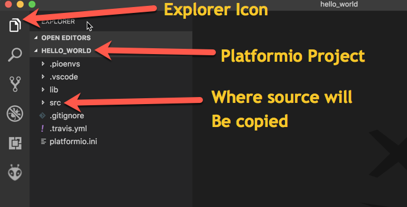
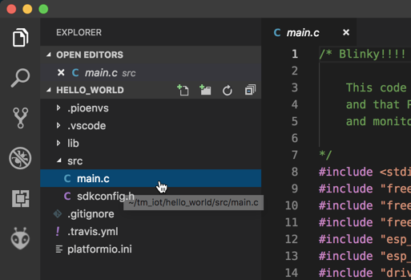
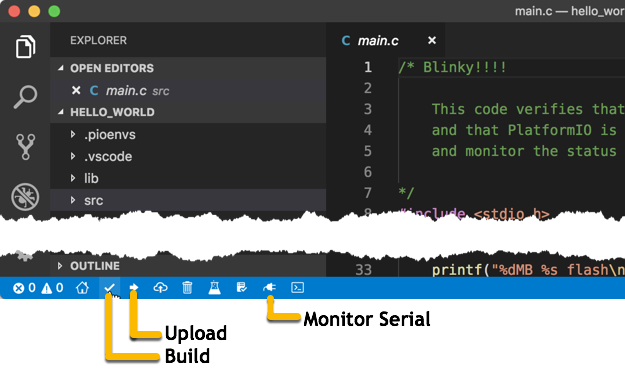

# Lab 2: Local LED Toggle

Upon completion you will have programmed your development board to toggle the LED when pressing the user button. This lab covers the basics of how to work with code on your laptop, and then compile, flash, and test on the MCU (development board).

This lab covers:

* Opening a PlatformIO project within VSCode
* Making small changes to the project code
* Compile/flash/monitor development process

## Setup Hardware

For the workshop labs, the ESP32 DevKit-C is placed in a breadboard, and an LED connected to a GPIO pin. When completed, the setup should look like this:

INSERT IMAGE OF COMPLETE KIT

1. Position the DevKit-C so that the pins are aligned with the breadboard holes. There should be an open set of holes next to the pin labeled (XXXX).
2. With gentle pressure, use both thumbs to slowly press the MCU into the breadboard until it is firmly in place.
3. With the provided LED, place the black cable into the hole next to the pin labeled XXXX. Place the colored cable into the hole next to GND.
4. Connect the USB cable to the MCU and then to your laptop. The onboard power indicator LED will come on.

## Create Platformio Local Project Hello World

Using Platformio from inside of VSCode, create a new project for the ESP32. This will pre-populate the template for the board, and setup the directory structure for the firmware to be built.

1. Open or navigate to VSCode

2. Open *Command Palette...* (⇧-⌘-P for macOS or ⇧-CTRL-P for Windows) and type `platformio: home`and hit enter

3. From the Platformio home page, select *Quick Access*->*New Project* and enter the following:

   **Name**: hello_world

   **Board**: Espressif ESP32 Dev Module

   **Framework**: ESP-IDF

   **Location**: Uncheck and select the `tm_iot` directory then click Finish

At this the default settings for a new project will have been created, and a folder added in the Explorer pane called *hello_world*.



:exclamation: If the folder does not get added automatically, right-click in the Explorer pane and select *Add Folder to Workspace...,* navigate to the `tm_iot` and select the `hello_world` folder and click *Add*.


## Copy and Compile Code

Copy (not move) the file `tm_iot/workshop-ess-alexa-controlled-device/code/lab_2-hello_world_led/main.c` to the project folder: `tm_iot/hello_world/src/main.c`, which will update to show the source file:



:bulb:When referenced in other labs, follow the same process to copy and replace code in the different projects.

The normal development process is:

​	write code -> build (compile) -> upload (flash) -> monitor serial (debug)

The quickest is to follow the build, flash, monitor process is to use the Platformio icons at the bottom of the VSCode window, with the project selected. You can also use the *Command Palate...* option as above, to select the Platformio operation.



1. With the `main.c` open, click the Build icon to start the build process.

   :bulb: The first time a compile starts with a new chipset or on a new install, it can take a long time to download, install the build tools, and pre-compile all of the various libraries. Initial build times of 4-10 minutes are common.

2. Look for the [SUCCESS] message in the terminal window, which indicates that the operation completed and the firmware is ready for uploading to the MCU.

   ```
   ===================== [SUCCESS] Took 10.10 seconds =====================

   Terminal will be reused by tasks, press any key to close it.
   ```

:bulb: At this point you have compile code that will operate on the MCU--once it has been flashed in the next step.

## Uploading and Monitor Code

The process of uploading (flashing) the code to the MCU stores it in a location that when the MCU is powered up or reset, loads and executes the code. If you take a look at the `main.c` code, there are two main things that happening. The first is a loop that runs 10 times then restart the MCU. Within that loop, depending if the iteration is odd or even, the connected LED is turned on or off, and an output statement is sent to the serial port.

1. Connect, or verify that the MCU is connected and the port is active (per lab 1).
2. Click the *Upload* icon to start the upload process
3. As with the build process, monitor the status in the terminal window and that the `[SUCCESS]` message appears

At this point, the LED connected to the MCU should be toggling between on and off every second. to verify, you will use the monitor serial function to look at the output of the `printf` statements.

4. Click the Monitor Serial icon to see the output of the MCU code.
5. By default the terminal is set at 9600 baud while the MCU is outputting at 115,200 baud. To correct, click inside the Terminal pane to set focus, the type CTRL-T followed by `b` to bring up the prompt to enter a new baud rate. Here enter `115200` and press return/enter.
6. At this point you should see the details of the MCU detailed output. Look for the *Turning LED on|off* lines.

:bulb: Every time you use the Monitor Serial command you will have to manually select the correct baud rate. You can change the default baud rate by adding the following line to the `platformio.ini` file, within the `[env:esp32dev]` section:

​	GAA_baud_rate command

Restart VSCode and the new baud rate will take affect.

