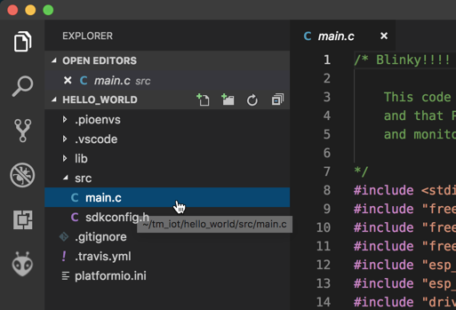
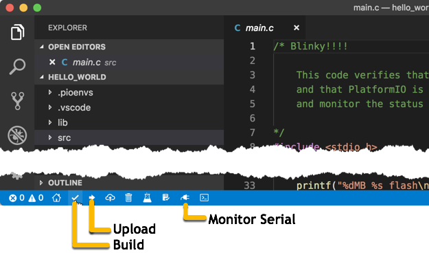

# Module 3: WiFi and MQTT

In this module, you will create the next Platformio project and configure the MCU to connect to WiFi and connect to the CloudMQTT broker to *publish* telemetry and *subscribe* for commands from the Alexa Skill.

Upon completion you will have created a new Platformio application and programmed your development board to act as a smart device for your Alexa skill.

This module covers:

* Creating a new Platformio project
* Configuring for WiFi and Internet connectivity
* Use the on-board USER button to send a test message
* Use the CloudMQTT console to monitor messages
* Using the monitor to verify connections

## Create and Configure Smart Device Application

Follow the procedure from module 2 to create a new Platformio application and copy the template code:

1. Create new Platformio project and enter the following:

   **Name**: smart_device

   **Board**: Espressif ESP32 Dev Module

   **Framework**: ESP-IDF

   **Location**: Uncheck and select the `tm_iot` directory then click Finish

This should complete almost immediately because the dependencies have been installed from the first application. You will need to add the `monitor_speed` line to the `platformio.ini` file (each project has its own file).

:exclamation: If the folder does not get added automatically, right-click in the Explorer pane and select *Add Folder to Workspace...,* navigate to the `tm_iot` and select the `smart_device` folder and click *Add*.

2. Copy the file `tm_iot/workshop-ess-alexa-controlled-device/code/mod_3-smart_device/main.c` to the project folder: `tm_iot/smart_device/src/main.c`

3. This code uses an additional library. To easily include, add the following lines to the `[env:esp32dev]` section of the `platformio.ini` file:

   ```ini
   [env:esp32dev]
   xxx = yyy
   
   # Add these lines to the bottom of the file
   
   lib_deps =
       # Using library Id
        5670
   
        # Using library Name
        MQTT library for ESP32 (ESP-IDF)
   
        # Depend on specific version
        MQTT library for ESP32 (ESP-IDF)@1.0.0
   
        # Semantic Versioning Rules
        MQTT library for ESP32 (ESP-IDF)@^1.0.0
        MQTT library for ESP32 (ESP-IDF)@~1.0.0
        MQTT library for ESP32 (ESP-IDF)@>=1.0.0
   ```


## Copy and Compile Code

Copy (not move) the file `tm_iot/workshop-ess-alexa-controlled-device/code/lod_2-hello_world_led/main.c` to the project folder: `tm_iot/hello_world/src/main.c`, which will update to show the source file:



:bulb:When referenced in other modules, follow the same process to copy and replace code in the different projects.

The normal development process is:

​	**write code -> build (compile) -> upload (flash) -> monitor serial (debug)**

The quickest is to follow the build, flash, monitor process is to use the Platformio icons at the bottom of the VSCode window, with the project selected. You can also use the *Command Palate...* option as above, to select the Platformio operation.



1. With the `main.c` open, click the Build icon to start the build process.

   :bulb: The first time a compile starts with a new chipset or on a new install, it can take a long time to download, install the build tools, and pre-compile all of the various libraries. Initial build times of 4-10 minutes are common.

2. Look for the [SUCCESS] message in the terminal window, which indicates that the operation completed and the firmware is ready for uploading to the MCU.

   ```
   ===================== [SUCCESS] Took 10.10 seconds =====================

   Terminal will be reused by tasks, press any key to close it.
   ```

:bulb: At this point you have compile code that will operate on the MCU--once it has been flashed in the next step.

## Uploading and Monitor Code

The process of uploading (flashing) the code to the MCU stores it in a location that when the MCU is powered up or reset, loads and executes the code. If you take a look at the `main.c` code, there are two main things that happening. The first is a loop that runs 10 times then restart the MCU. Within that loop, depending if the iteration is odd or even, the connected LED is turned on or off, and an output statement is sent to the serial port.

1. Connect, or verify that the MCU is connected and the port is active (per module 1).
2. Click the *Upload* icon to start the upload process
3. As with the build process, monitor the status in the terminal window and that the `[SUCCESS]` message appears

At this point, the LED connected to the MCU should be toggling between on and off every second. to verify, you will use the monitor serial function to look at the output of the `printf` statements.

4. Click the Monitor Serial icon to see the output of the MCU code.
5. By default the terminal is set at 9600 baud while the MCU is outputting at 115,200 baud. To correct, click inside the Terminal pane to set focus, the type CTRL-T followed by `b` to bring up the prompt to enter a new baud rate. Here enter `115200` and press return/enter.
6. At this point you should see the details of the MCU detailed output. Look for the *Turning LED on|off* lines.

:bulb: Every time you use the Monitor Serial command you will have to manually select the correct baud rate. You can change the default baud rate by adding the following line to the `platformio.ini` file, within the `[env:esp32dev]` section:

​	`monitor_speed = 115200`

It should look similar to this:

```ini
[env:esp32dev]
platform = espressif32
board = esp32dev
framework = espidf
monitor_speed = 115200
```

Restart VSCode and the new baud rate will take affect.

