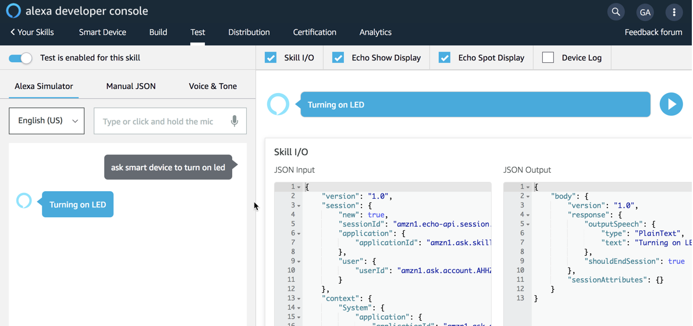

# Module 4: Alexa Skill and End-to-End

In this module, you will build the Alexa Skill in the Amazon Developer console and test the *intent* programmed. The skill, locally running on your laptop, will *publish* a message to CloudMQTT to turn on, or off, the light (LED).

Upon completion you will have created an Alexa skill and demonstrated that it can execute the application logic to publish messages to MQTT and control your MCU.

This module covers:

* Navigating the Amazon Developer console
* Creating a new Alexa Skill
* Setting up *intents* (actions to take place) and *utterances* (what your tell the skill what to do)
* Run a local program, serviced by *ngrok* to listen and act on the skill to publish MQTT messages
* See the MCU take action

## Create the Alexa Skill

From a new browser, navigate to the [Amazon Developer Console](https://developer.amazon.com/), sign-in if needed, then click on [Alexa](https://developer.amazon.com/alexa). From the top menu, mouse *Your Alexa Consoles* and click on *Skills*. This takes you to the main list of skills, if any exist.

From here, click on *Create Skill* and complete the following:

* **Skill Name**: `Smart Device`
* **Choose model**: Make sure *Custom* is selected

then click on *Create Skill*. On the *Choose a template page*, make sure *Start from scratch* is selected and click *Choose*. This will take you to the main development page. You will complete the 2nd through 4th sections on the right, under *Skill builder checklist*. the first section is complete, so click on *2. Intents, Samples, and Slots*. Under *Create custom intent*, enter `led_on` and click *Create custom intent*. This takes you to the sample utterances section for this intent. Enter the following, one per line, and click the plus icon in the right of the utterance field:

```
to turn on the led
to turn on the light
to turn on the lamp
lamp on
light on
turn on the lamp
turn on the light
turn on the led
```

These utterances help train the machine learning model for your skill. With these entered for the *led_on* intent, click the *add* button to the left to create a new intent for *led_off*.

Again, create a custom intent named `led_off`, and enter the following for the utterances:

```
to turn off the led
to turn off the light
to turn off the lamp
lamp off
light off
turn off the lamp
turn off the light
turn off the led
```

:bulb: You can select all lines above, click on *Bulk Edit* and paste in to the text box instead of copy/pasting each line.

At this point, click on *Save Model* near the top center. Next the endpoint, where the Skill with communicate with to invoke application logic, needs to be configured and running. Leave the browser open here while you complete the other work.

## Configure and Run Skill Logic

The skill needs something execute when an *intent* is matched--that will be your local python code. In order for it to be accessible from the Internet, *ngrok* is used to broker an HTTPS connection from Amazon Alexa to your locally running code.

1. In VSCode, open the `~/tm_iot/workshop-ess-alexa-controlled-device/code/mod_4-alexa_skill/skill.py` file, and similar to the changes made in the MCU code, configure the CloudMQTT variables.

    ```python
    # Enter your CloudMQTT endpoint and credentials
    MQTT_HOST            = 'FQDN'
    MQTT_WEBSOCKET_PORT  =  portnun
    MQTT_USERNAME        =  'username'
    MQTT_PASSWORD        =  'password'
    ```

2. Open a terminal window, change to the `mod_4-alexa_skill` directory and the  and start the code as follows:

   ```python sk
   python3 skill.py
    * Running on http://127.0.0.1:5000/ (Press CTRL+C to quit)
    * Restarting with stat
    * Debugger is active!
    * Debugger PIN: 256-577-502
   ```

3. Next, open a second window (it doesn't need to be in any particular directory) to start *ngrok* and use the port number above (5000) as the parameter:

   ```bash
   ngrok http 5000
   ```

   This will start the ngrok server, clear the screen and display something similar. Note the last *forwarding* line (https) and copy everything through the ngrok.io portion.

## Finish Alexa Skill

With both ngrok acting as the reverse proxy and your skill running locally, go back to the Alexa Developer page and click on *Endpoint* from the left menu (you may need to scroll down to see it). Select the *HTTPS* option and complete the following:

* Default Region: Paste the the HTTPS ngrok address from above (e.g.: https://92c745b4.ngrok.io)
* Select SSL certificate type: My development certificate is a sub-domain of a domain that has a wildcard certificate from a certificate authority

Then click *Save Endpoints* from above. Then select *Build* (next to Test) and verify that the skill have *green* check marks for 1 through 4 on the right hand side. At this point, click on *Test* and toggle the *Test is disabled for this skill.* to *enabled*. 

## Test the Skill

The moment of truth. At this point the skill is active and ready to receive inquiries. In the *Alexa Simulator* box, click into the *Type or click and hold the mic* and enter the following:

```
turn on led
```

If all is setup and working, you should see the following in the test console:



The left pane shows the command issues and the response. Also, monitoring CloudMQTT and looking at the MCU, it took should have turned on the LED. Now try turning off the LED. Play around with the test console and try different utterances. 


## What Was Learned

In this module you:

* 

